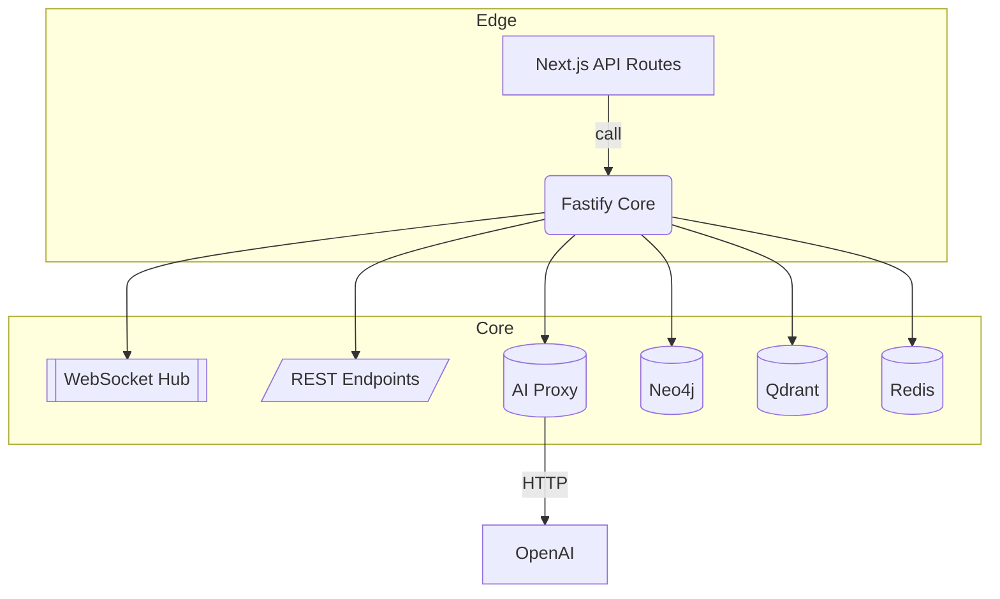
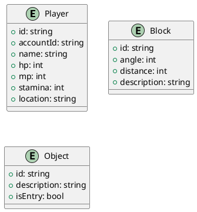

# 后端技术需求文档

## 1. 目标

提供支持文字版 MMORPG《贝克莱世界》的后台服务，涵盖身份认证、游戏世界状态管理、AI 生成管线和实时通信，满足下列指标：

- 指令到首字节延迟 ≤ 200 ms（同区域）
- WebSocket 并发连接 ≥ 5 000（单实例）
- 99.9 % 可用性，恢复时间 < 5 min

## 2. 技术栈

| 类别      | 选型                                  | 说明                           |
| --------- | ------------------------------------- | ------------------------------ |
| 运行时    | Node.js 20 LTS                        | 统一 TypeScript 生态           |
| HTTP 框架 | Next.js API Routes（MVP） → Fastify 4 | MVP 快速迭代，后期迁移提升性能 |
| 实时通信  | `fastify-websocket`                   | WS + 心跳/重连                 |
| 语言      | TypeScript 5 strict                   | 单源代码                       |
| AI 服务   | OpenAI GPT-4o / Qwen3 32B             | 通过内部 SDK 调用              |
| 向量检索  | Qdrant                                | block / object 嵌入存储        |
| 图数据库  | Neo4j                                 | 世界实体与关系                 |
| 缓存      | Redis                                 | 会话、速率限制、消息队列       |
| 日志      | Pino + Winston transport              | JSON 结构化日志                |
| 监控      | Prometheus + Grafana                  | 指标 / 告警                    |
| 测试      | Vitest + Supertest                    | 单元 / 集成                    |
| 部署      | Docker + GitHub Actions + Fly.io      | 蓝绿发布                       |

## 3. 服务架构



说明：

1. MVP 阶段 `NJS` 与 `F` 同一进程；迁移后二者分离，走内网 HTTP。
2. `WS` 负责多路复用与房间广播；指令解析由 `F` 内部 handler 完成。

## 4. 数据模型（简化）



## 5. API 设计（MVP）

### Auth

| Method | Path                | Body              | Desc           |
| ------ | ------------------- | ----------------- | -------------- |
| POST   | `/api/auth/signup`  | `{ email, code }` | 邮箱验证码注册 |
| POST   | `/api/auth/login`   | `{ email, code }` | 登录并返回 JWT |
| GET    | `/api/auth/refresh` | —                 | 刷新令牌       |

### Game Actions

| Method | Path          | Body       | Desc             |
| ------ | ------------- | ---------- | ---------------- |
| POST   | `/api/action` | `{ text }` | 玩家文本指令     |
| GET    | `/api/state`  | `?cursor=` | 拉取增量世界状态 |

### AI Utilities

| Method | Path                        | Body                               |
| ------ | --------------------------- | ---------------------------------- |
| POST   | `/api/extract_motives`      | `{ text }`                         |
| POST   | `/api/scan_objects`         | `{ text }`                         |
| POST   | `/api/generate/detail_obj`  | `{ entry_term, external_objects }` |
| POST   | `/api/generate/inner_scene` | `{ entry_term, external_objects }` |

### WebSocket

`wss://domain.com/ws/play?token=JWT`

Frame example (server → client):

```json
{ "type": "chunk", "content": "You enter a narrow alley…" }
```

## 6. 实时管线

1. 客户端建立 WS 连接并发送 `join` 帧。
2. 服务器校验 JWT，放入玩家房间。
3. 玩家发指令 `text`。
4. Fastify 解析并分类：
   - **世界查询**：直接读取 Neo4j / Qdrant。
   - **AI 生成**：缓存命中 → 返回；否则调用 OpenAI → 写入 DB → 返回。
5. 结果分片 (`≤50` chars) 推送给客户端。
6. 心跳：客户端 30 s ping；服务器 60 s idle 断线。

## 7. 性能与扩展

- 单实例 QPS 预计 500；CPU 占用 <70 % 时自动扩容。
- 使用 Redis Stream 作为 WS 节点广播队列，支持水平扩展。
- 向量检索与图数据库走独立容器，异步写。

## 8. 安全

- JWT + HttpOnly Cookie；WS 使用 `token` 查询串。
- 指令速率限制：20 req/s /player；登录 5 次/min /IP。
- OWASP Top 10 审计；CI 运行 `npm audit --production`。

## 9. 监控与日志

- **指标**：CPU、内存、WS 连接数、指令延迟 p95、AI 调用失败率。
- **日志**：pino 输出 JSON，按 `service:tag` 区分；生产 7 天留存。

## 10. 测试策略

| 层级 | 工具       | 覆盖               |
| ---- | ---------- | ------------------ |
| 单元 | Vitest     | util、handler      |
| 集成 | Supertest  | REST & WS          |
| E2E  | Playwright | 登录 → 指令 → 反馈 |

## 11. 迭代计划

| Sprint | 内容                            |
| ------ | ------------------------------- |
| S1     | Auth + API Routes + 基础 WS Hub |
| S2     | AI Proxy + Qdrant 接入          |
| S3     | 图数据库建模 + 持久化           |
| S4     | 性能优化 & 分布式部署           |
