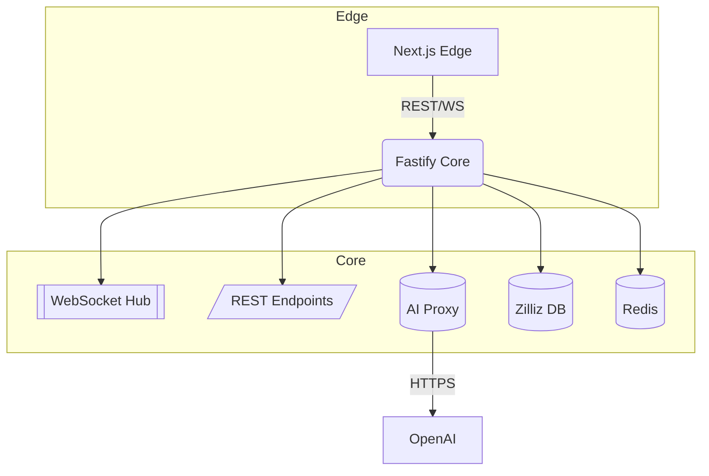

# 后端技术需求文档（Fastify + Zilliz DB）

## 1. 目标

为文字版 MMORPG《贝克莱世界》提供高性能、可扩展的后台服务，核心指标：

- 单实例 QPS ≥ 500
- 指令到首字节延迟 ≤ 200 ms（同区域）
- WebSocket 并发连接 ≥ 5 000
- 99.9 % 可用性，故障恢复 < 5 min

---

## 2. 技术栈

| 类别      | 选型                             | 说明                         |
| --------- | -------------------------------- | ---------------------------- |
| 运行时    | Node.js 20 LTS                   | 与前端统一 TypeScript 生态   |
| HTTP 框架 | Fastify 5                        | 极致性能、插件体系           |
| 实时通信  | `@fastify/websocket`             | WS + 心跳/重连               |
| 向量检索  | Zilliz Cloud (Milvus 2.4)        | 托管向量 DB，自动分片 & 扩缩 |
| 缓存      | Redis 7                          | 会话、速率限制、发布订阅     |
| AI 服务   | OpenAI GPT-4o / Qwen3 32B        | 通过内部 SDK 调用            |
| 日志      | Pino + Winston transport         | JSON 结构化日志              |
| 监控      | Prometheus + Grafana             | 指标 / 告警                  |
| 测试      | Vitest + Supertest               | 单元 / 集成                  |
| 部署      | Docker + GitHub Actions + Fly.io | 蓝绿发布                     |

---

## 3. 服务架构



说明：

1. MVP 阶段前端 `Edge` 与 `API` 可同实例部署；高并发场景下拆分为独立服务。
2. 向量检索与世界实体元数据均存于 Zilliz DB，同步缓存到 Redis 以降低延迟。

---

## 4. 数据模型（简化）

Milvus 集合 `entities`：

- **vector**：`float32[1024]` — 描述文本的句向量（BGE-base-zh）
- **主键**：`uid`（`varchar(36)`）
- **payload**（Scalar Fields）：
  - `type` (string) — `player`｜`block`｜`object`
  - `blockId` (string) — 所属区块 ID
  - `edges` (JSON) — 关系列表 `{ to: uid, rel: string }[]`
  - `meta` (JSON) — 其他属性（HP、描述等）

分区策略：按世界大区 `region_{n}` 自动路由，提升并行度。

---

## 5. API 设计（MVP）

### Auth

| Method | Path                | Body              | 描述           |
| ------ | ------------------- | ----------------- | -------------- |
| POST   | `/api/auth/signup`  | `{ email, code }` | 邮箱验证码注册 |
| POST   | `/api/auth/login`   | `{ email, code }` | 登录并返回 JWT |
| GET    | `/api/auth/refresh` | —                 | 刷新令牌       |

### Game Actions

| Method | Path          | Body       | 描述             |
| ------ | ------------- | ---------- | ---------------- |
| POST   | `/api/action` | `{ text }` | 玩家文本指令     |
| GET    | `/api/state`  | `?cursor=` | 拉取增量世界状态 |

### AI Utilities

| Method | Path                        | Body                          |
| ------ | --------------------------- | ----------------------------- |
| POST   | `/api/extract_motives`      | `{ text }`                    |
| POST   | `/api/scan_objects`         | `{ text }`                    |
| POST   | `/api/generate/object`      | `{ entry_term, ext_objects }` |
| POST   | `/api/generate/inner_scene` | `{ entry_term, ext_objects }` |

### WebSocket

`wss://domain.com/ws/play?token=JWT`

示例帧（服务器 → 客户端）：

```json
{ "type": "chunk", "content": "You enter a narrow alley…" }
```

---

## 6. 向量检索管线

1. 客户端发送指令 `text`。
2. Fastify 解析类型：
   - **查询**：根据上下文构建向量 → Zilliz DB 相似度检索（top-k）。
   - **生成**：调用 OpenAI → 返回新实体 JSON。
3. 对于生成结果：
   - 生成描述向量并 `insert` 至 Milvus。
   - 更新相邻实体 `edges` 字段，写入 Redis 缓存。
4. 结果分片（≤ 50 chars）推送至 WebSocket。

---

## 7. 性能与扩展

- Zilliz Cloud 自动水平扩缩；读写毫秒级延迟（同区域）。
- 使用 Redis Stream 作为 WS 节点间广播队列，支持多实例。
- Fastify `ajv` 编译 JSON Schema，验证开销 < 5 µs。
- CPU 占用 > 70 % 时触发 Fly.io Vm 自动扩容。

---

## 8. 安全

- JWT（RS256）+ HttpOnly Cookie；WS `token` 查询串。
- OWASP Top 10 静态扫描 + `npm audit` CI。
- 登录 5 次/min /IP，指令 20 req/s /player。

---

## 9. 监控与日志

- **指标**：CPU、内存、WS 连接数、Milvus RTT、AI 调用失败率。
- **日志**：pino 结构化输出，按 `service:tag` 区分；生产 7 d 留存。

---

## 10. 测试策略

| 层级 | 工具       | 覆盖                     |
| ---- | ---------- | ------------------------ |
| 单元 | Vitest     | util、service            |
| 集成 | Supertest  | REST & WS                |
| E2E  | Playwright | 登录 → 指令 → 反馈流闭环 |

---

## 11. 迭代计划

| Sprint | 内容                               |
| ------ | ---------------------------------- |
| S1     | Auth + 基础 WS Hub + Redis 缓存    |
| S2     | Zilliz DB 接入 & worldService CRUD |
| S3     | AI 生成管线 + 数据模型优化         |
| S4     | 性能调优 & 灰度发布                |

---

_本文档适用于 Fastify + Zilliz DB 后端方案，后续根据产品与性能需求持续迭代更新。_
